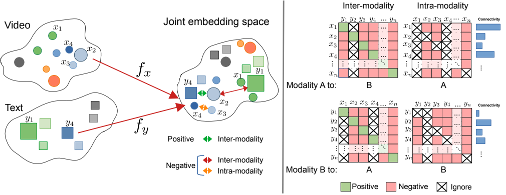
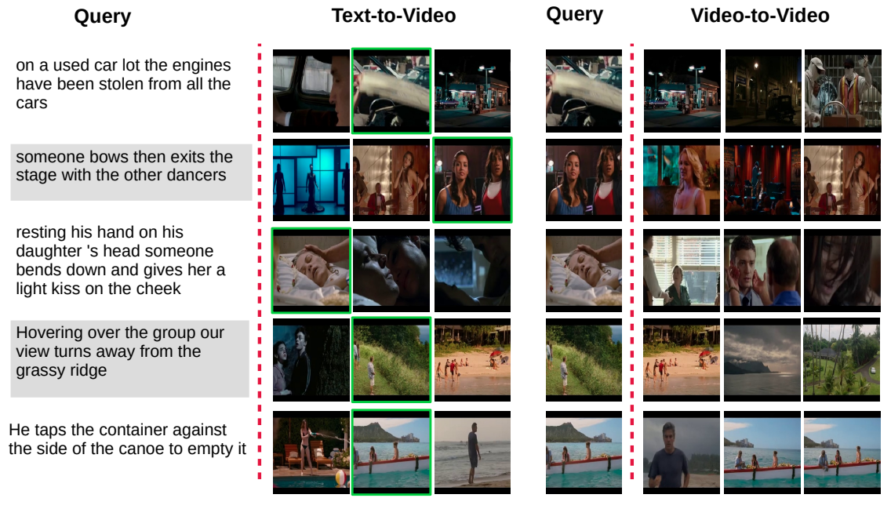

# CrossCLR - ICCV 2021
<p align="center">
  
</p>
This is the official implementation of paper:

### CrossCLR: Cross-modal Contrastive Learning For Multi-modal Video Representations [[Paper]](https://arxiv.org/abs/2103.00020) 

Authors: 
[Mohammadreza Zolfaghari](https://mzolfaghari.github.io/),
[Yi Zhu](https://bryanyzhu.github.io/),
[Peter Gehler](http://gehler.io/),
[Thomas Brox](https://lmb.informatik.uni-freiburg.de/people/brox/index.html),


## Update

##### [Dec 2021] CrossCLR-onlyIntraModality released
## Loss Function
The loss function [`SupConLoss`](https://github.com/HobbitLong/SupContrast/blob/master/losses.py#L11) in `losses.py` takes `features` (L2 normalized) and `labels` as input, and return the loss. If `labels` is `None` or not passed to the it, it degenerates to SimCLR.

Usage:
```python
from trainer.loss import CrossCLR_onlyIntraModality

# define loss with a temperature `temp` and weights for negative samples `w`
criterion = CrossCLR_onlyIntraModality(temperature=temp, negative_weight=w)

# features: [bsz, f_dim]
video_features = ...
text_features = ...

# CrossCLR
loss = criterion(video_features, text_features)

...
```


## Qualitative samples

<p align="center">
  
</p>

## Reference
```
@article{crossclr_aws_21,
  author    = {Mohammadreza Zolfaghari and
               Yi Zhu and
               Peter V. Gehler and
               Thomas Brox},
  title     = {CrossCLR: Cross-modal Contrastive Learning For Multi-modal Video Representations},
  url       = {https://arxiv.org/abs/2109.14910},
  eprinttype = {arXiv},
  booktitle = {Proceedings of the IEEE/CVF International Conference on Computer Vision (ICCV)},
  month     = {October},
  year      = {2021},
}
```


## Security

See [CONTRIBUTING](CONTRIBUTING.md#security-issue-notifications) for more information.

## License

This project is licensed under the Apache-2.0 License.

